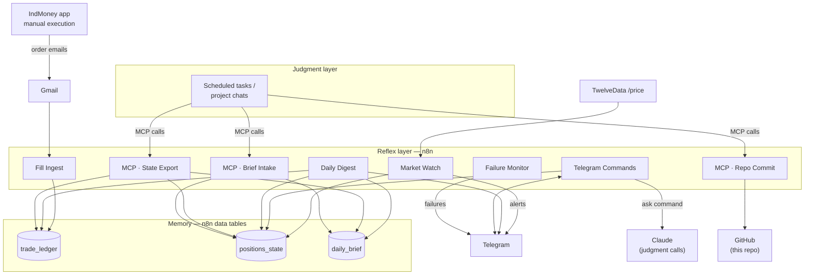

# Tradeframe

**A personal trading operating system, and the backtests that decided what it's allowed to do.**

Built by [Zoeb Nomi](https://zoebnomi.com/?utm_source=github&utm_medium=readme&utm_campaign=tradeframe) · related work: *CrossSource* ([DOI 10.5281/zenodo.21969577](https://doi.org/10.5281/zenodo.21969577)) · MIT licensed, see [LICENSE](LICENSE).

*Internally the system still carries its original build name, "Trading OS v3" — that's what the live n8n workflows below are named, and the changelog keeps that label for accuracy. Tradeframe is the platform this repo is published under, meant to hold this US build plus the India build and future markets/instruments as they come online.*

---

## Start here: two backtests, and neither rule survived them

Before any of the automation below got built, two trading rules got tested against real price
history — an ATR-scaled trailing stop, and a volatility gate for leveraged-sector ETFs. Full
methodology, per-name tables, and every caveat are in
[`research/us-stocks-backtest-2026-08.md`](research/us-stocks-backtest-2026-08.md). The short
version:

> **Neither rule is supported.** ATR-scaled stops do not reliably beat a plain fixed-percentage
> stop — the result is non-monotonic across the ATR multiplier tested, and the one setting that
> wins is carried by two names out of five. The leveraged-ETF volatility gate fails decisively:
> it loses to buy-and-hold on both CAGR and Sharpe in all four pairs tested, at every threshold,
> under two different cash-rate assumptions — and the mechanism is diagnosable: the gate excludes
> high-realised-volatility days, but in these sectors the biggest *up* days raise realised
> volatility exactly like the biggest down days do, so the gate is filtering out upside, not risk.

Neither of those is the interesting part. The interesting part is that "run the test, watch it
fail, keep the simpler rule" is the actual design process behind this system — not a footnote
added after the fact. The report documents its own sample-selection bias (Test 1's five names
were chosen *because* they stopped out and rallied back, which biases the comparison toward
wider stops before a single number is computed) and states plainly where a headline-looking
number (SOXL at the p60 threshold, +24.3% CAGR) is noise once you look at its neighbouring
thresholds. Nothing here is presented as more certain than the data supports — including where
that means concluding "don't change anything."

If you've read [CrossSource's mirror-eval work](https://doi.org/10.5281/zenodo.21969577), this
is the same instrument, pointed at a different domain: an honest test can conclude "no effect,"
and reporting that conclusion faithfully is the entire point of running it.

---

## Then: what the system actually does

Personal trading operating system for US equities traded manually on IndMoney (no broker API).
Built August 2026.

**Design principle: reflexes are automated, judgment is not.** n8n handles deterministic
monitoring, logging, and alerting — the reflex layer. Scheduled Claude sessions handle analysis
and decisions — the judgment layer. All orders execute manually; the system never places a
trade itself.



### Reflex layer (n8n workflows)

| Workflow | What it does |
|---|---|
| IndMoney Fill Ingest | Polls Gmail every 15 min for IndMoney order emails, parses fills/cancellations/dividends into `trade_ledger` (deduped by email message id). Stop fills get a distinct alert. |
| Market Watch | Every 30 min during market hours: batch-fetches prices, updates the 20-day high-water mark, and alerts on near-stop (within 2%), a ratchet-driven raise-stop recommendation, or a take-profit hit. Manual/test runs are dry runs — no writes. |
| Telegram Commands | Command bot: `done SYMBOL [PRICE]` to update the live stop and clear a pending action, `status`, `ask <question>` for a Claude judgment call with full state as context, `help`. |
| Daily Digest | 06:30 IST: yesterday's brain brief if under 24h old, every open position with stop distance and earnings flags, pending-action nags past 20h, and the last 24h of ledger events. |
| Global Failure Monitor | Shared error handler for every active workflow — sends failure alerts with the failed node, error message, and execution link. |
| MCP · State Export | Read bridge: positions + recent ledger + latest brief as one JSON object, for the judgment layer to read. |
| MCP · Brief Intake | Write bridge: the judgment layer's daily brief and earnings-date updates land here. |
| MCP · Repo Commit | Commits files to a GitHub repo via the contents API — the mechanism this README's own history is meant to run on. |

The reflex layer runs a few more workflows day to day — a nightly screener, a recommendation
scorer, and the live desk UI behind the Telegram bot — that aren't included here because they're
either still-evolving research surface or pure UI, not core to the loop above. This table is the
system's core, not a partial redaction of it.

### Memory (n8n data tables)

- **`trade_ledger`** — every order event parsed from IndMoney emails. See [`schemas/tables.md`](schemas/tables.md).
- **`positions_state`** — live positions, stops, ratchet parameters, pending actions, earnings dates.
- **`daily_brief`** — one row per day, written by the judgment layer.

### Judgment layer

Scheduled Claude sessions read state through the State Export bridge, write the daily brief and
earnings updates through Brief Intake, and commit monthly reports and doc updates through Repo
Commit. An ad hoc `ask` command in Telegram routes questions to Claude with live state as
context — three portfolio layers (Core / Amplifier / Tactical), a stop ratchet that only ever
tightens, thesis-driven exits, and a hard rule against tightening stops through an earnings date.

### Ops runbook

- **A workflow fails** → a failure alert arrives with the execution link. Open it, check the
  failed node. Failure alerts fire for production runs only.
- **No fill alerts arriving** → check the Gmail trigger's recent executions on Fill Ingest, and
  confirm the alert channel isn't muted.
- **No price updates** → the price-feed key may be rate-limited; the workflow logs credit usage
  per run.
- **A raise-stop alert arrives** → move the stop at the broker, then reply `done SYMBOL PRICE`
  (or `done SYMBOL` to accept the recommended level as-is).
- **Bridge auth** → State Export, Brief Intake and Repo Commit each validate a bearer token in
  their own code node; none of the three tokens are committed anywhere in this repo.
- **Credentials** — Gmail, Telegram (two bots: alerts and monitoring), the price feed, GitHub,
  and the LLM provider are all referenced by n8n credential ID only. Secrets live in n8n's
  credential store, never in workflow JSON or in this repo.

Two v2-era workflows (an earlier Google-Sheets-backed alert system and its companion Telegram
handler) are retired and archived — kept out of the active workflow list, superseded entirely
by the v3 design above.

### Changelog

**v3 — 11 Aug 2026** — Initial Trading OS v3: fill ingest from IndMoney emails, `trade_ledger`
with historical backfill, `positions_state` with a tiered stop-loss ratchet (trails below the
20-day high, never lowers), Market Watch alerting, a Telegram command bot with a Claude `ask`
command, a daily digest, global failure monitoring, and the Claude↔n8n MCP bridges (state
export / brief intake / repo commit) that make this repo self-updating.

---

## What's in this repo

```
README.md
LICENSE
research/
  us-stocks-backtest-2026-08.md   — the backtests this README leads with
docs/
  broker-decision-aug2026.md      — why the system stays on IndMoney over a broker API
schemas/
  tables.md                       — the three data-table schemas referenced above
workflows/
  *.json                          — condensed exports of each n8n workflow's structure and logic
reports/                          — monthly reports land here, committed by the repo-commit bridge
```

Workflow exports describe structure and logic, not full n8n node dumps — implementation ids,
credential references, the live instance's address, and inbound webhook identifiers are not
included; every place one would appear is a `{{PLACEHOLDER}}`. Nothing in this repo is a working
credential, and nothing here can be replayed against a live system.
