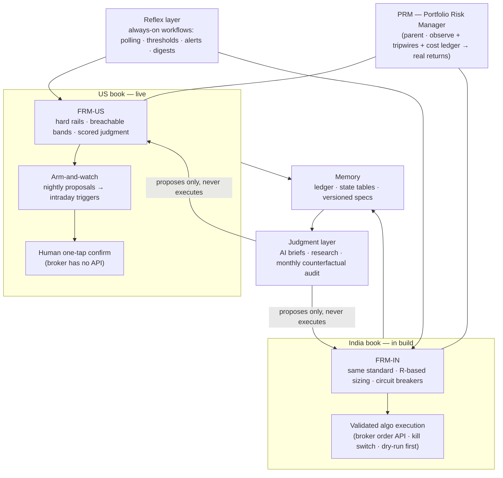

# TradeFrame

A personal trading operating system: automated reflexes, AI judgment, human (or algorithmic) execution — with risk management as the first-class module. Two books, one risk standard: a **US equities book** (live; fully automated analysis, human one-tap execution) and an **India equities book** (in build; algorithmic execution via broker API).

**📖 Interactive system guide:** https://zoeb-nomi.github.io/tradeframe/ *(sanitized public edition — operational identifiers deliberately absent)*

## System flow

**Design rules that hold everywhere:** the AI proposes, a deterministic layer validates against hard rails, and only then does a human (US) or validated code (India) execute — an LLM hallucinating a quantity is structurally incapable of causing a trade. Each book has its own kill switch; an automated halt can stop *new* risk but never touches exits or protective stops. Every decision is scored against a do-nothing baseline, and returns are reported net of **all** costs.
